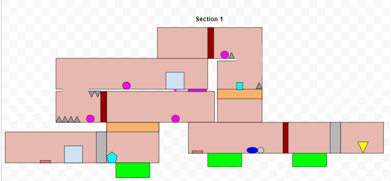

[](https://classroom.github.com/a/YyUO0xtt)
# COMP2150  - Level Design Document
### Name: Joshua Martin
### Student number: 47708336

This document discusses and reflects on the design of your platformer level for the Level Design assessment. It should be 1500 words. Make sure you delete this and all other instructional text throughout the document before checking your word count prior to submission. Hint: You can check word count by copying this text into a Word or Google doc.

Your document must include images. To insert an image into your documentation, place it in the "DocImages" folder in this repo, then place the below text where you want the image to appear:

```

```

Example:


## 1. Player Experience (~700 words)
Outline and justify how your level design facilitates the core player experience goals outlined in the assignment spec. Each section should be supported by specific examples and screenshots of your game encounters that highlight design choices made to facilitate that particular experience.

### 1.1. Discovery
What does the player learn? How does your encounter and broader level design facilitate learning in a way that follows good design practice?

Initially when the player starts the game, they appear in a room with only a few things to interact with. 


Upon further inspection around the room, the player learns that platforms can be jumped through both upwards and downwards, spikes hurt when they touch them, and switches activate when you walk over them causing the door in front of it to open, incentivising that the other doors can also be opened if a switch is found. The rock walls are uninteractable until the player discovers what to do with them later in the level. Only a few mechanics are initially introduced in order to not overwhelm the player. 

Going through the opened door begins the first section of the level, and the player is introduced to two new objects: the pressure plate and the pushable box. The player learns that when they step on the pressure plate, the door opens, and when they step off it, the door closes, not leaving the player any time to run through. They also learn that the box can be pushed in either direction. With gentle nudging through how the room is designed by how the box can only be pushed left to cause any drastic changes, the player with their problem solving skills can figure out to push the box onto the pressure plate to keep the door open, the player learning one of the main mechanics of how to complete the level: pushing a box on to a pressure plate.


In the next room, the player learns they need to use the same mechanic, box on pressure plate, but is further introduced to a few more mechanics such as acid and how to avoid hazards with increasing simple and nuanced control. As shown above, mechanics are discovered by the player naturally, using purely the design of the level and the player's own problem solving skills, and gradually, so as to not overwhelm the player with information.

### 1.2. Drama
What is the intensity curve? How does your design facilitate increasing yet modulating intensity, with moments of tension and relief? 

The intensity curve to visualise is a zig-zag moving diagonally upwards. The level is designed so that inbetween the moments of increasing tension are moments of relief. In between in each section, the player gains access to infirmaries located in the starting area.


Each infirmary holds 3 hearts each and acts as a way to recover after or during the first and second section. 

Not only between the sections but also within them are moments of relief, except section 3. During section 1 and 2, there are moments where players have to keep moving as well as moments where players can just stop and think about what they will do. For example, during section 2, the player will have to jump up a series of platforms while being attacked by a combination of spitters and chompers, but afterwards can rest at the next checkpoint.


### 1.3. Challenge
What are the main challenges? How have you designed and balanced these challenges to control the difficulty curve and keep the player in the flow channel?

This level engages with the physical, intellectual, and perceptive skills of the player regularly. For example in section 2, there is a part where the player will encounter a lake they have to cross. They have to look around for a solution, finding a box to push into the lake (perceptive), solve how to use the solution, pushing it into the lake (intellectual), then act upon it, jumping onto the box to cross the lake (physical).


The level keeps the player in the flow channel by having the sections ascend in difficulty, the first section having problem solving, the seconnd section having harder problem solving, and the final section having problem solving in timed conditions. The sections also have clear objectives and immediate rewards when completing them besides the keys. For example, after completing the first section and returning to the starting area, the player will see that they now have access to the section 1 infirmary and the section 2 area as well as making progress to unlocking the bottom entrance, having one of the doors opened.


### 1.4. Exploration
How does your level design facilitate autonomy and invite the player to explore? How do your aesthetic and layout choices create distinct and memorable spaces and/or places?

From the beginning of the level, the player is free to explore the starting area. After investigating it, the player will realise there are 5 entrances and only one they can open.


The player is invited to explore regularly throughout the level in order for them to figure out how to get to the sections goal. For example, when the player reaches the first section and unlock the ability to break the rock walls, in the vicinity is 2 rock walls on the players screen. The player then is incentivised to break those walls to explore more of the level in order to reach the encounters goal. Alternatively if the player has thoroughly explored the starting area, they can recall more rock walls to be broken at that location, thus is given the liberty to go back and break those first. 


In important areas, the yellow brick tile is commonly used and is a pattern throughout the level, highlighting the main starting area incentivising the player to keep coming back to it, and highlighting the infirmaries and keys inviting the player to figure out how to get inside given its emphasized nature.

## 2. Core Gameplay (~400 words)
A section on Core Gameplay, where storyboards are used to outline how you introduce the player to each of the required gameplay elements in the first section of the game. Storyboards should follow the format provided in lectures.

Storyboards can be combined when multiple mechanics are introduced within a single encounter. Each section should include a sentence or two to briefly justify why you chose to introduce the mechanic/s to the player in that sequence.

You should restructure the headings below to match the order they appear in your level.

### 2.1. Acid, Checkpoints, and Passthrough Platforms
During the first section, the player is immediately met with three mechanics: the acid, checkpoints, and passthrough platforms. The design is simple, but necessary so that the player understands these mechanics which form the rest of the level and are the most important.


### 2.2. Weapon Pickup (Staff) and Chompers

Also in the first section, the player gains access to the staff and is able to fend for themselves against the chompers. Gaining access to the staff early on is important due to it being one of the main factors of interactivity within the level. 

### 2.3. Spikes

Spikes are introduced in section 1 with similar intention to the acid, to show the player the types of hazards they will see throughout the level.

### 2.4. Keys

At the end of the first section, the player finds one of the three keys needed to get out. 
Each section has a key at the end and acts as the sections immediate reward.

### 2.5. Health Pickup

At the starting area, everytime the player unlocks a piece of equipment, they gain access to the infirmaries which each hold 3 health pickups. The pickups are given to the player gradually so as to not make the first section too easy and too reward the player for unlocking the tools.

### 2.5. Weapon Pickup (Gun)

At the start of section 2, the player gains access to the gun which is another core mechanic during section 2 and 3.

### 2.6. Moving Platforms and Spitters

During section 2, moving platforms and spitters are introduced inconjuction with each other as a way to encourage the player to use the gun as platforms will move away from the spitter which will shoot at you from range, encouraging the player to use range back at the spitter.

## 3. Spatiotemporal Design
A section on Spatiotemporal Design, which includes your molecule diagram and annotated level maps (one for each main section of your level). These diagrams may be made digitally or by hand, but must not be created from screenshots of your game. The annotated level maps should show the structure you intend to build, included game elements, and the path the player is expected to take through the level. Examples of these diagrams are included in the level design lectures.

No additional words are necessary for this section (any words should only be within your images/diagrams).
 
### 3.1. Molecule Diagram


### 3.2. Level Map – Section 1


### 3.3.	Level Map – Section 2


### 3.4.	Level Map – Section 3


## 4. Iterative Design (~400 words)
Reflect on how iterative design helped to improve your level. Additional prototypes and design artefacts should be included to demonstrate that you followed an iterative design process (e.g. pictures of paper prototypes, early grey-boxed maps, additional storyboards of later gameplay sequences, etc.). You can also use this section to justify design changes made in Unity after you drew your level design maps shown in section 3. 

You should conclude by highlighting a specific example of an encounter, or another aspect of your level design, that could be improved through further iterative design.

Iterative design helped improve the level by allowing ideas to be more organised to create a greater final level design. Through the creation of level design diagrams of all 3 sections, all my ideas were able to be visualised and thus created in Unity. As I began creating these designs in Unity, I realised that the design of the level did not suit the tiles I wanted to use (the dirt tiles) and looked too artificial with the completely flat walls and floors, thus made a big decision to slightly mould the ground and walls of the whole level to try make it more natural and give that cave aesthetic rather than an artificial tunnel.

Before:


After:


During the design process, specifically when I was making the molecule diagram, I also realised that the sections would have to connect somehow and thus was the creation of the main starting area where all the sections would join up to make a cohesive experience. I also realised during playtesting that health was easily lost during these sections, therefore I added rooms with health which I named the "infirmaries" to assist more moderately-skilled players who are prone to lose health. 


During the playtesting process, I also realised that some parts of the level were either too boring/easy, so I made some changes in order to up the difficulty. For example, during section 2 where the player tries to solve how to cross the acid lake, the whole process is relatively easy and boring, and thus I added some spikes, spitters, and a rock wall to try and impede the player.


One thing I could probably improve through further iterative design is the final section. Although it is meant to be the hardest in difficulty, which it does accomplish, it also feels like the quickest section out of the 3. Further testing could be done in order to extend the duration of the section, filling it with more and harder puzzles, as well as having a proper combat section which the whole level lacks a bit in. Most of the physical engagement of the level comes from platforming but adding a part specifically for combat would enhance the experience even further.

## Generative AI Use Acknowledgement

Use the below table to indicate any Generative AI or writing assistance tools used in creating your document. Please be honest and thorough in your reporting, as this will allow us to give you the marks you have earnt. Place any drafts or other evidence inside this repository. This form and related evidence do not count to your word count.
An example has been included. Please replace this with any actual tools, and add more as necessary.


### Tool Used: ChatGPT
**Nature of Use** Finding relevant design theory.

**Evidence Attached?** Screenshot of ChatGPT conversation included in the folder "GenAI" in this repo.

**Additional Notes:** I used ChatGPT to try and find some more relevant design theory that I could apply to my game. After googling them, however, I found most of them were inaccurate, and some didn't exist. One theory mentioned, however, was useful, and I've incorporated it into my work.

### Tool Used: Example
**Nature of Use** Example Text

**Evidence Attached?** Example Text

**Additional Notes:** Example Text


